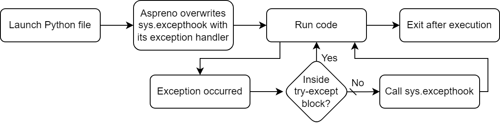
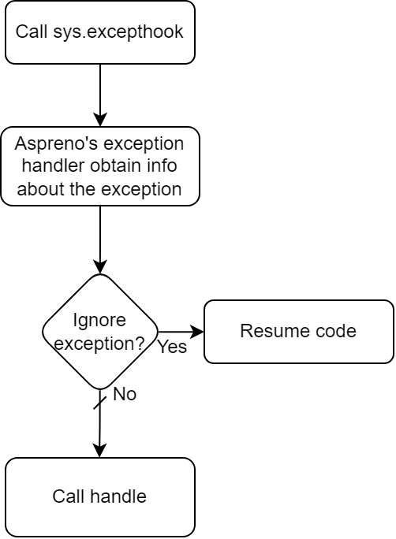

Basic information about Aspreno
===============================

How does Aspreno work?
----------------------

At its core, Aspreno make usage of Python's :py:mod:`sys`'s module, as this module exposes a function called :py:func:`excepthook() <sys.excepthook>`.
This function is called whenever an exception has been raised and hasn't been caught by the developer (try-except).

Aspreno ships its own excepthook in the :py:class:`ExceptionHandler <aspreno.global_handler.ExceptionHandler>` class, so Aspreno will overwrites the default :py:func:`sys.excepthook` with its own handler, that will then pass the required argument to the :py:meth:`handle <aspreno.global_handler.ExceptionHandler.handle>` method.

So far, it look like this:

This totally assumes your code is *perfect*, but exceptions happens and your code just crash!

Now, if we add an exception, here's what happens:

*Note that the code will only continue to run if applicable. (For example, your code will stop to run if the exception happened in the file you've launched and is not inside a function/method, which will stop the program), so depending of the context, it can also immediately exit.*

We are now to the point where :py:func:`sys.excepthook` is being called, this is where the magic 🧙 happens!
At this point, Aspreno has taken over the default excepthook and will now act. In the default implementation of the Aspreno's :py:class:`ExceptionHandler <aspreno.global_handler.ExceptionHandler>`, you can ask to ignore specific exceptions. After the exception handler checked if its ignored or not, if the raised error is NOT to be ignored, it will begin executing the :py:meth:`handle <aspreno.global_handler.ArgumentedException.handle>` method.

